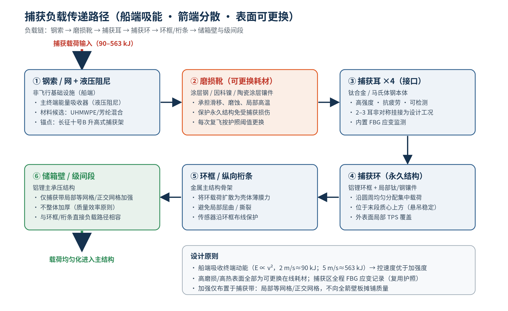
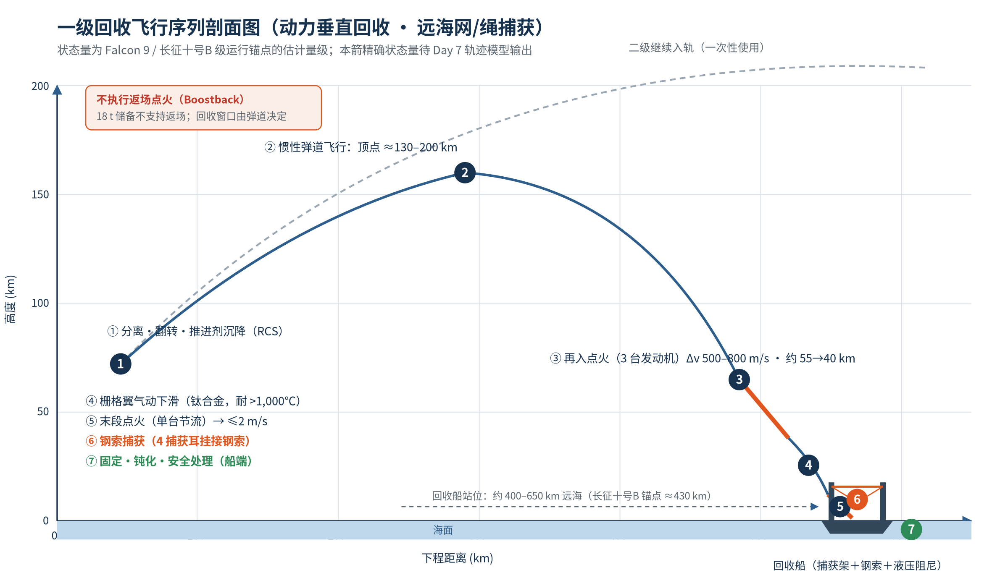
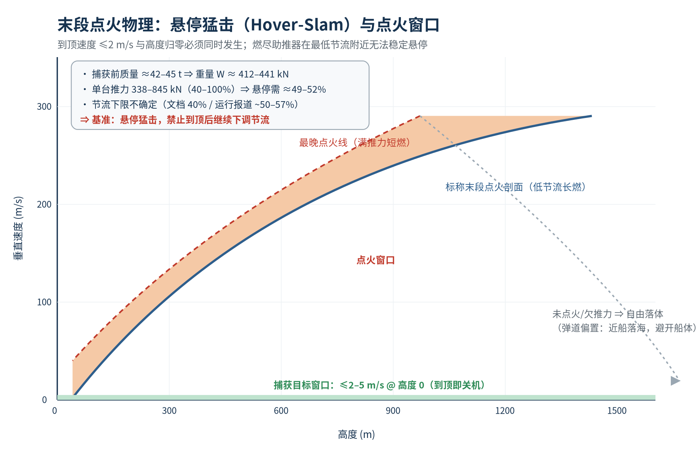
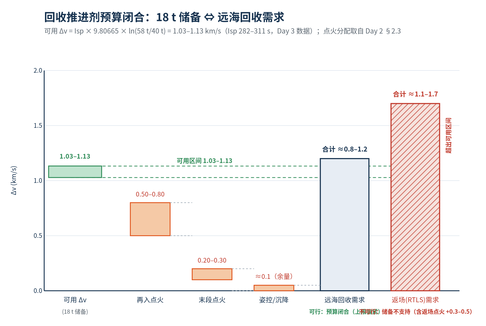

# Reusability Strategy and Recovery Concept
### AI Co-Design of a Reusable Rocket — Work Package 6 of 10
**Date:** 16 July 2026 (Day 6) · **Deliverable class (program schedule):** *Recovery concept*
**Document status:** Finalized issue (supersedes the preliminary Day 6 draft contained in the compiled program report, pp. 88–91)

---

> **Document basis statement.** This issue is developed from the Day 1–4 work-package outputs and from externally cited operational sources. Day 5 trajectory-simulation products are excluded from this issue's quantitative basis pending the trajectory-model verification allocated to the Day-7 work package; where absolute flight states are required, ranges anchored to cited operational vehicles are used and are explicitly marked as estimates. Instances in which this issue refines or supersedes statements made in Day 1–4 documents are logged in the Cross-Document Consistency Register (Section 9).

**Abstract.** This report defines the reusability strategy and first-stage recovery concept for a two-stage, 600 t-class, LOX/RP-1 reusable launch vehicle designed to deliver 20,000 kg to Sun-synchronous orbit (SSO). A six-family trade of recovery methods is conducted against the mission requirements established on Day 1 and the propulsion constraints established on Day 3. Propulsive vertical-landing (VTVL) in the downrange ocean regime is selected, with a **hybrid catch-compatible terminal architecture** (catch ring, four catch lugs with replaceable wear shoes, grid fins, selective thermal protection, and minimal emergency crush pads), inherited as the binding decision of the Day 4 architecture work package. The recovery sequence is decomposed into seven phases and analyzed at first order: ballistic coast, a three-engine entry burn (500–800 m/s), grid-fin aerodynamic descent, and a committed single-engine terminal burn terminating at ≤ 2 m/s engagement velocity. A Tsiolkovsky closure shows that the allocated 18,000 kg recovery propellant reserve provides 1.03–1.13 km/s against a downrange requirement of approximately 0.8–1.2 km/s, and formally excludes any boostback/return-to-launch-site mode, consistent with the documented ~15% (ocean) versus ~30% (RTLS) payload-penalty asymmetry. The concept is externally validated against the Long March 10B sea-based net recovery of 10 July 2026 and the Starship Flight-5 tower catch of 13 October 2024, and internally against current Block-5 refurbishment economics. Inspection, refurbishment, service-life, and fleet targets are specified, and the remaining verification items are allocated to the Day 7 (design iteration) and Day 8 (reliability and economics) work packages.

**Keywords:** reusable launch vehicle; propulsive recovery; net/cable capture; hover-slam; refurbishment; recovery propellant reserve; Sun-synchronous orbit

---

## 1. Introduction and Scope

### 1.1 Purpose
The Day 6 deliverable of the program schedule is the *recovery concept* for the reusable first stage. This report (i) consolidates the reusability strategy from the mission-level requirements, (ii) conducts and closes the recovery-method trade study, (iii) defines the recovery system architecture and flight sequence at first order, (iv) closes the recovery propellant budget against the Day 4 mass allocation, and (v) specifies the operations concept (inspection, refurbishment, service life, and fleet targets) together with the residual verification items. The treatment is architectural and analytical; detailed trajectory, structural, and cost analyses remain allocated to the Day 7–8 work packages per the program schedule.

### 1.2 Inputs from Previous Work Packages
Table 1 lists the binding inputs inherited from earlier work packages. Any refinement of these inputs required by the present analysis is registered in Section 9.

**Table 1 — Binding inputs inherited from Day 1–4 work packages.**

| Design input | Adopted value | Origin | Role in this report |
|---|---|---|---|
| Payload mass | 20,000 kg | Day 1 §2 | Fixes the high-energy mission class that forces downrange recovery (§3.3) |
| Target orbit | Sun-synchronous orbit | Day 1 §2 | High-inclination trajectory ⇒ ocean downrange corridor (§5.6) |
| Reusability penalty planning figures | ~20–25% payload; +25% stage-1 dry mass | Day 1 §2 | Bracket checked against external penalty data (§2.4, §9) |
| Cost / cadence requirements | < $30M per launch; ≥ 10 flights/year | Day 1 §2 | Drives service-life and turnaround targets (§7) |
| Recovery Δv reserves | boostback 300–500; entry 500–800; landing 200–300 m/s | Day 2 §2.3 | Burn allocations used in the closure of §6 |
| Engine data (Merlin 1D class) | 845 kN SL thrust; throttle 40–100%; gas-generator cycle; reuse heritage | Day 3 §2.2 | Terminal-burn physics (§5.3); restart demand (§5.2) |
| First-stage mass model | dry 40,000 kg; recovery reserve 18,000 kg; recovery hardware 5,500 kg | Day 4 §5.2–5.3 | Reserve closure (§6); capture mechanics (§5.4) |
| Recovery architecture | hybrid catch-compatible (ring, lugs, wear shoes, crush pads; vessel-side net/cable + damping) | Day 4 §4.4–4.6 | Binding terminal architecture (§4) |
| Guidance architecture | inertial/GNSS → corridor control → vessel-relative navigation | Day 4 §8.2 | Terminal guidance specification (§5.2, Phase 4) |
| Reuse-passport sensor system | FBG/thermal network at catch ring, fin roots, tanks, engine bay | Day 4 §3.2 | Certification basis (§7.1) |
| Failure-mode set | terminal miss, vertical-velocity exceedance, asymmetric engagement, wear, shell overload, plume, slosh, saltwater | Day 4 §8.5 | Extended in §8 (two 2025 landing-burn losses added) |

### 1.3 Material Excluded From This Issue
The Day 5 OpenRocket ascent products (staging state, Max-Q, flight-profile times) are under physics verification in the Day-7 work package and are not used here. Recovery-state magnitudes below are therefore literature-anchored ranges (Falcon 9 / Long March 10B class) with the estimation method stated; this is conservative for concept definition because all closures are expressed in terms of Δv budgets rather than specific trajectory points.

> **[Figure 1 — Day 6 Work Package Context Diagram]**
> *Block diagram: Day 1–4 inputs → Recovery concept definition (this report) → Day 7–8 outputs. See `diagrams/svg_recovery_sequence.png` for the operational sequence.*

---

## 2. The Economic Rationale for Reusability

### 2.1 Why the First Stage Dominates Launch Cost
The first stage is the largest and most capital-intensive module of the vehicle: it carries all nine engines, the thrust structure, and the largest tank volume. Industry reporting of SpaceX's 2026 SEC filing places the booster alone at approximately **60–75% of total launch cost** [1]. The economic premise of first-stage reuse is therefore direct: the most expensive module is the one recovered. With a new Falcon-9-class booster costing on the order of **$30M** and refurbishment of a recovered booster reported at roughly **$300k — under 1% of replacement cost** [1][2], the marginal cost of a reflown booster approaches propellant, ship operations, ground support, and the mandatory pre-flight static fire [2]. This mechanism underlies the Day 1 cost requirement (< $30M/launch) and its external benchmark: reused-booster operations have driven the price to LEO from roughly $9,000–10,000/kg class to approximately $2,500–2,700/kg, a reduction of ~75% [1].

### 2.2 Amortization, Service Life, and Breakeven
SpaceX's S-1 prospectus (filed publicly 20 May 2026; Nasdaq debut June 2026) discloses that Block 5 first stages are **depreciated over 25 flights for accounting purposes, with an engineering life target of up to 40 flights** [1][2][3]. Independent operator commentary had earlier established the operative reuse arithmetic: refurbishment below 10% of new-booster cost, **breakeven at the second flight, and net savings from the third flight onward** [4]. The record fleet behavior confirms the model: booster B1067 has flown 36 times; of 165 Falcon 9 missions in 2025, 157 used a previously flown booster [1][2].

For planning, the per-flight booster-hardware contribution may be written

$$
C_{\text{hw/flight}} \;=\; \frac{C_{\text{booster}}}{N_{\text{life}}}\quad\Rightarrow\quad
\frac{\$30\text{M}}{15\text{–}25}\;=\;\$1.2\text{–}2.0\text{M per flight},
\tag{2.1}
$$

i.e., two orders of magnitude below the hardware cost of an expendable first stage, before accounting for refurbishment (Day 1 allowance: $5M/flight, conservative against the cited $300k class benchmark — a conservatism explicitly recorded for the Day 8 cost model; §9).

### 2.3 Turnaround as an Economic Variable
Refurbishment speed bounds the achievable cadence as tightly as cost. Current fleet practice reports an average booster turnaround of ~40 days, with best cases below three weeks [1][2]. For a fleet requirement of ≥ 10 flights/year (Day 1), the minimum active-booster count follows as

$$
N_{\text{boosters}} \;\gtrsim\; \frac{(\text{flights/yr})\times(\text{turnaround days})}{365}
\;=\;\frac{10\times 30}{365}\;\approx\; 0.8 \;\Rightarrow\; 2\text{–}3 \text{ vehicles in rotation with attrition margin}.
\tag{2.2}
$$

This fleet-sizing logic is carried into the targets of §7.4.

### 2.4 Reusability Is Not Free: Performance Penalties
Reuse purchases its economics with propellant and hardware mass. Operator-stated figures put the payload-performance penalty at approximately **15% for ocean (downrange) recovery and ~30% for return-to-launch-site (RTLS)** [5]; a Falcon Heavy configuration with side-boosters recovered at land and an expended core was quoted near 10% [6]. The Day 1 planning brackets (20–25% payload penalty, +25% stage-1 dry mass) are consistent with these figures, sitting conservatively between the ocean and RTLS cases; no Day 1 modification is required (§9).

> **[Figure 2 — Per-Flight Cost Breakdown]**
> *Bar chart of cost components (booster amortization, upper stage, fairing, refurb, ops, propellant). Quantified in Day 8 report §2.*

---

## 3. Recovery Method Trade Study

### 3.1 Method Taxonomy and Operational Heritage
Six recovery method families with flight heritage or demonstration are identified in Table 2.

**Table 2 — Recovery method families, heritage, and measured characteristics.**

| # | Method family | Heritage / demonstration (cited) | Quantified characteristics |
|---|---|---|---|
| 1 | Parachute + ocean splashdown | Space Shuttle SRBs (routine 1981–2011); Rocket Lab Electron ocean recovery since 2020 [7][8] | Electron reentry ~9,000 km/h, external temperatures to ~2,400°C; saltwater exposure a principal refurbishment driver; ocean recovery feasible on ~60–70% of launches [7][8] |
| 2 | Parachute + mid-air aerial catch | Electron helicopter catch, one brief capture May 2022 then released; **program abandoned** in favor of ocean recovery [7][9] | Operationally fragile; feasible on ~50% of launches vs 60–70% for ocean recovery; cost-neutral at best [7] |
| 3 | Propulsive VTVL — deck/pad on legs | Falcon 9 (>600 booster recoveries; 650th program flight June 2026) [1][2]; New Shepard (suborbital); New Glenn first landing Nov 2025 [10] | Ocean landing penalty ~15%; RTLS ~30% [5]; landing success ≳ 98% on recent attempts (operator-reported, estimate) |
| 4 | Propulsive VTVL — tower-arm catch | Starship Super Heavy Flt 5, 13 Oct 2024: first-attempt catch; Flt 7, Jan 2025: repeat despite one engine failing to relight in boostback [11][12] | Deletes leg mass; "enables immediate repositioning… ready to refly in under an hour" (Musk) [11]; requires launch-site return propellant; failure endangers ground infrastructure |
| 5 | Propulsive VTVL — sea-based net/cable catch | **Long March 10B, 10 Jul 2026: first net-based orbital booster recovery in history** [13–16] | Capture ~6 min after stage separation; ship ~430 km downrange; 3-engine entry burn; 4 grid fins; four hooks onto moveable tensioned steel cables [14][16] |
| 6 | Winged VTHL — runway | Space Shuttle orbiter (135 missions; ≤ 39 flights/airframe); X-37B | High cross-range; wings/gear mass; no current orbital-class operational winged booster |

### 3.2 Evaluation Criteria
The trade is scored against: (i) compatibility with the Day 3 engine capabilities (deep throttle 40–100%, 3–4 restarts per mission); (ii) flight-mass penalty at fixed 600 t GLOM; (iii) mission-geometry fit (20 t SSO, high inclination); (iv) technology readiness; (v) refurbishment burden; and (vi) infrastructure risk. Criteria (i)–(iii) are binding in this program (mission- and mass-constrained), while (iv)–(vi) rank the terminal variants within the selected family.

### 3.3 Trade Outcome
**Family selection — propulsive VTVL (rows 3–5).** Parachute systems (rows 1–2) cannot exploit the restart/deep-throttle propulsion already mandated by Day 3, offer limited terminal precision for a 40 t-class vehicle, and expose hardware to saltwater; winged recovery (row 6) carries the highest non-recurring cost with no present orbital-class precedent. Propulsive VTVL is additionally the only family compatible with off-world logistics (no runway/sea dependence), aligning with the program's long-term intent.

**Terminal-variant selection — hybrid catch (row 5 principle, hardened by row-3 fallback features).** Within the propulsive family, Day 4 §4.4 traded the terminal architectures; the comparison and its mass consequences are reproduced in Table 3 and are adopted here as binding.

**Table 3 — Terminal architecture trade (adopted from Day 4 §4.4/§5.6, quantities re-verified).**

| Concept | Flying recovery hardware mass | Recovery reserve | Principal risks | Status |
|---|---|---|---|---|
| Legged propulsive landing | 8,000 kg | 24,000 kg | touchdown loads; leg-deployment failure modes | mature precedent; **fallback** |
| Pure net/cable catch | < 5,500 kg (est.) | ~18,000 kg (est.) | single-point catch engagement; limited public history | rejected as sole system |
| **Hybrid catch-compatible** | **5,500 kg** | **18,000 kg** | catch-load design; shipborne damping system | **selected baseline** |

At fixed GLOM, the selection frees 2,500 kg of flying hardware mass relative to the legged fallback — reinvested in Day 4 into +5,000 kg ascent propellant and +4,500 kg growth margin. *(Day 7 addendum: The descent simulation subsequently showed that the reserve propellant requirement is driven by entry ballistics and is identical for both catch and legged configurations at ≥34.5 t; the 6,000 kg reserve saving originally claimed is not supported.)* The selection is externally event-anchored: the Long March 10B flight of 10 July 2026 demonstrated the exact terminal function (hooks onto tensioned ship cables) six days before this report's issue [13–16].

> **[Figure 3 — Six-Method Recovery Trade Radar]**
> *Radar/spider chart scoring 6 recovery methods × 6 criteria. See report Table 4 for the full scoring matrix.*

---

## 4. Recovery System Architecture

### 4.1 Booster-Side (Flying) Hardware
All items below are counted in GLOM and budgeted inside the 5,500 kg recovery-hardware and 27,000 kg structure/thrust-path allocations of Day 4 §5.2:

1. **Catch ring** — circumferential structural band in the upper booster/interstage region, carrying an Al-Li ring frame with local Ti/maraging-steel fittings; distributes concentrated catch loads into ring frames and stringers [Day 4 §3.3].
2. **Four catch-lug assemblies** — permanent inspectable Ti/maraging-steel bodies; the primary cable interface.
3. **Replaceable wear shoes** — sacrificial contact surfaces (coated steel, Inconel, or ceramic-coated inserts) preventing abrasion of permanent structure [Day 4 §7.5].
4. **Four titanium grid fins** — titanium survives reentry heating > 1,000°C without replacement, a Block-5-proven design point relative to earlier aluminum fins that eroded [2].
5. **Cold-gas RCS** — post-separation attitude control and propellant settling.
6. **Selective TPS** — engine bay, base heat-shield region, grid-fin roots/leading edges, catch-ring exterior, raceways [Day 4 §3.5].
7. **FBG/thermal sensor network (reuse passport)** — strain/thermal record at catch ring, lugs, fin roots, tanks, engine bay [Day 4 §3.2].
8. **Minimal emergency crush pads** — replaceable energy-absorbing cartridges for off-nominal deck contact only (not full landing legs) [Day 4 §4.5].

### 4.2 Vessel-Side (Non-Flying) Infrastructure
Excluded from GLOM by the design boundary of Day 4 §4.8: the capture frame with moveable tensioned steel cables/net; hydraulic damping system (primary terminal-energy absorber); relative-navigation beacons; blast-protected deck surfaces; post-catch securing clamps; and passivation/safing equipment. The operational template is the recovery ship *Linghangzhe* — reported as the first vessel outfitted with a cubic raised frame and moveable tensioned steel cables [14] — and its sister vessels in the current Chinese recovery fleet, which were stability-tested with a stage mockup in 4 m waves and operate tug-assisted station-keeping and a passivation robot analogous to SpaceX's Octagrabber [14]. Candidate net/cable materials remain UHMWPE/aramid hybrids (engineering candidates, not confirmed fleet data [Day 4 ref. 23]).

### 4.3 Catch Load Path
The designed load path, unchanged from Day 4 §3.3, is

$$
\text{cable} \rightarrow \text{wear shoe} \rightarrow \text{catch lug} \rightarrow \text{catch ring} \rightarrow \text{ring frames/stringers} \rightarrow \text{tank barrel / interstage},
$$

with local isogrid/orthogrid reinforcement confined to the catch belt rather than a globally thickened shell (mass-efficiency rationale documented in Day 4 §3.3, citing NASA isogrid structural heritage). The catch ring is positioned above the estimated terminal-descent center of mass so that a suspended booster hangs pendulum-stable beneath the engaged cables; this geometric assumption is registered as a Day-7 verification item (V-3, §8.3).

### 4.4 External Validation Anchors
1. **Long March 10B (10 July 2026, 04:15 UTC, Wenchang LC-2).** Seven YF-100K kerolox engines powered the first stage for ~2.5 min; the stage separated, performed a **three-engine entry burn**, steered with **four grid fins**, and was caught by its four upper hooks engaging the vessel's tensioned steel cables approximately **six minutes after separation**, ~**430 km downrange** in the South China Sea; the operator plans to **refly the recovered booster within calendar 2026** [13–16]. The vehicle's LEO payload class in reusable configuration is 16 t [15].
2. **Starship Super Heavy Flight 5 (13 Oct 2024).** After boostback and coast, the booster executed a 13-engine→3-engine landing sequence and was caught by the launch tower's arms on the first attempt; "thousands of distinct vehicle and pad criteria" were gated before commitment [11]. Flight 7 (Jan 2025) repeated the catch with one engine failing to relight during boostback, evidencing engine-out tolerance in the return sequence [12].
3. **Cautionary evidence — terminal-burn criticality.** LandSpace's ZhuQue-3 maiden flight (3 Dec 2025) reached its landing zone ~300 km downrange but was lost to a landing-burn issue; a CZ-12A first stage (23 Dec 2025) suffered abnormal combustion during the landing burn and impacted the ground [14]. These two losses, both in the terminal-burn phase, place **ignition/behavior of the landing burn at the top of the failure-mode register** (§8.1).

> **[Figure 4 — Recovery System Architecture Schematic]**
> 
> *System schematic: booster with catch ring, lug/wear-shoe detail, grid fins; vessel frame with tensioned cables and dampers; load path chain.*

---

## 5. Recovery Flight Sequence and First-Order Mechanics

### 5.1 Basis and State Vector
The sequence is analyzed using Day 2 burn allocations, Day 4 masses, and cited operational state magnitudes. For anchoring only, Falcon-9-class reusable-profile staging occurs at roughly **T+150–165 s, ~65–80 km, and ~2.0–2.3 km/s** (reusable profiles stage slower than expendable ones — ~Mach 6 vs Mach 10 class — to fund recovery [17]; operational Starlink-class telemetry reports ~65 km / ~8,000 km/h at ~T+150 s [18]; the high-energy JCSAT-14 profile separated near 8,350 km/h [19]). These are external reference values; this vehicle's staging state remains a Day-7 model output (§8.3, V-1).

### 5.2 Phase Analysis

**Phase 1 — Separation, flip, and settling (T_sep + 0–60 s, est.).** After low-shock pneumatic stage separation (all-pneumatic, low-shock system of record on the reference vehicle [23]), cold-gas RCS rotates the booster ~180° to an engines-forward entry attitude (the flip maneuver of record profiles [20]) and settles residual propellant over the tank baffles/anti-vortex devices (slosh-control provision, Day 4 §3.8) to guarantee relight feed conditions.

**Phase 2 — Ballistic coast (~2–5 min, est.).** With engines off, the vertical component of the staging velocity carries the booster to apogee,

$$
h_{\text{apo}} \;=\; h_{\text{sep}} + \frac{v_{v,\text{sep}}^{\,2}}{2\,g},
\tag{5.1}
$$

which for staging verticals of order 1–1.5 km/s (est., from the §5.1 anchors) yields apogees of order **130–200 km**, consistent with ~130–140 km class telemetry for ocean-recovery profiles [18] and ~200 km cited for high-energy return profiles [2][21]. Horizontal drift at the surviving downrange velocity (~1.5–2 km/s, est.) during the ~4–6 min coast delivers the booster above the pre-positioned vessel — this kinematic link, not a propulsive retargeting, sets the vessel station (§5.6).

**Phase 3 — Entry burn (~55–75 km, ~15–30 s, est.).** Three engines relight and remove **500–800 m/s** (Day 2 §2.3), bounding peak heating and structural load before the sensible atmosphere. Anchors: Falcon 9 ignites the 3-engine entry burn near ~55 km [1] (~70→40 km envelope in reference trajectory reconstruction [21]); LM 10B likewise used three engines [14]. For the 58 t booster with three Merlin-class engines at ~60% throttle (3×~507 kN), the T/W available is ≈ 2.7, making a 500–800 m/s removal feasible well inside the burn window (est.); precise Mach/heat-rate targets remain Day-7 outputs (V-2).

**Phase 4 — Grid-fin aerodynamic descent (~70 km → ~2 km).** Engines off; four titanium grid fins provide aerodynamic control authority from hypersonic through transonic regimes (deployed near ~70 km in record profiles [1]) while atmospheric drag reduces velocity to **~250–300 m/s** (est., operational telemetry class) at terminal-burn start. Guidance executes the three-layer logic of Day 4 §8.2 — inertial/GNSS propagation, grid-fin corridor control, then transition to vessel-relative navigation (ship beacon plus radar/lidar candidates [Day 4 refs. 34–35]) — replacing a fixed landing point with a moving capture envelope.

**Phase 5 — Terminal burn (final ~15–40 s, est.).** The center engine relights at deep throttle. Two governing physics points:

(a) *Hover-slam constraint.* The booster mass at engagement is $m_b \approx 42\text{–}45$ t (40 t dry plus residuals, est.), i.e., weight $W \approx 412\text{–}441$ kN. A single Merlin-class engine spans 338–845 kN over the documented 40–100% throttle range [Day 3 §2.2]. The hover condition requires

$$
T = W \;\Rightarrow\; \text{throttle}_{\text{hover}} = \frac{412\text{–}441}{845} \approx 49\text{–}52\%.
\tag{5.2}
$$

The documented 40% floor would *marginally* permit hover; the operational floor reported for the class engine (~50–57% [22]) would not. The baseline concept of operations therefore adopts the **committed hover-slam**: the burn starts at an altitude/velocity pair such that velocity nulls to the engagement target **≤ 2 m/s exactly at capture height**, with burn-start timing and upward throttle steps (never downward) providing control authority; the engine shuts down at engagement. This mirrors demonstrated practice on near-empty boosters whose minimum-throttle thrust exceeds vehicle weight [22], and Day 2 §1 already records the same constraint internally.

(b) *Failure-containment geometry.* The terminal trajectory is biased so that an unlit or underperforming engine results in a near-vessel water impact rather than a vessel impact [22]. Engagement targets at the lugs: **vertical velocity ≤ 2 m/s; lateral offset ≤ 5 m; attitude error ≤ 3°; angular rate ≤ 1°/s** (engineering targets — V-2/V-4 verification items, §8.3).

**Phase 6 — Cable engagement and energy absorption.** The four lugs engage the tensioned cables; the vessel's hydraulic damping — not the booster structure — absorbs the residual kinetic energy,

$$
E_c \approx \tfrac{1}{2} m_b v_c^{\,2}:
\qquad
45{,}000\text{ kg} @\,2\text{ m/s} \Rightarrow 90\text{ kJ};
\quad @\,5\text{ m/s} \Rightarrow 563\text{ kJ},
\tag{5.3}
$$

quantifying the ∝v² leverage of terminal-velocity control over structural reinforcement (Day 4 §8.3). Asymmetric engagement (first contact on 2–3 lugs) is a sizing load case for the lug/ring/isogrid path; wear shoes absorb sliding/abrasion as sacrificial line items; crush pads cover an off-nominal low capture or deck contact.

**Phase 7 — Safing, securing, protection (post-capture).** Auxiliary cables and automated clamps stabilize the suspended booster (as demonstrated operationally on LM 10B [16]); residual propellants and pressurants are isolated or vented; a robot-assisted passivation secures residual hazards [14]. The booster is never immersed: saltwater exposure is a principal corrosion and refurbishment driver (RETALT finding, Day 4 ref. 33; corroborated by Electron ocean-recovery experience [7][8]).

### 5.3 Consolidated Event Timeline

**Table 4 — Reference recovery timeline (magnitudes: estimates anchored to cited operational profiles).**

| Event | Time class | State class | Anchor |
|---|---|---|---|
| MECO / separation | T+150–165 s | ~65–80 km; ~2.0–2.3 km/s | [17][18][19] |
| Apogee (no boostback) | T+~4–6 min | ~130–200 km | Eq. 5.1; [2][18][21] |
| Entry burn (3 engines) | T+~5–7 min | ~55→40 km; Δv 500–800 m/s | Day 2 §2.3; [1][21] |
| Grid-fin descent | T+~6–8 min | hypersonic→subsonic → ~250–300 m/s | [1] |
| Terminal burn (center engine) | final 15–40 s | ~300 → ≤ 2 m/s | Day 2 §2.3; [22] |
| **Cable engagement** | **~6–8 min after separation** | ≤ 2 m/s at capture height | LM 10B ~6 min [14][16] |

### 5.4 Recovery-Zone Geometry and Maritime Operations
The vessel stations on the ascent ground track beneath the ballistic capture point. Cited stations: ~430 km downrange (LM 10B, ship *Linghangzhe*) [14]; several-hundred-km class with ~600 km typical of high-energy droneship missions (reference trajectory reconstructions [21]). **Design assumption: vessel station 400–650 km downrange**, refineable only after the Day-7 trajectory repair. Maritime operating assumptions (to be handed to Day 8 economics): capture operable at sea state ≤ 4 with wave heights up to ~3–4 m (4 m-wave stability testing is documented in the current Chinese recovery fleet [14]); weather-window availability 70–80% (est., planning figure).

> **[Figure 5 — Seven-Phase Recovery Sequence]**
> 
> *State-machine: Separation → Flip → Ballistic Coast → Entry Burn → Grid-fin Glide → Terminal Burn → Cable Engagement → Passivation.*

> **[Figure 6 — Hover-Slam Ignition Window]**
> 
> *Altitude-velocity plot showing the committed hover-slam corridor: ignition at ~1.5–2.0 km, velocity nulled to ≤2 m/s at 15 m capture height.*

---

## 6. Recovery Propellant Budget — Closure Analysis

The reserve of 18,000 kg rides unburned through ascent (carried mass of 58,000 kg at separation: 40,000 dry + 18,000 reserve). Available recovery Δv:

$$
\Delta v_{\text{avail}} = I_{sp}\, g_0 \ln\!\frac{m_{\text{sep}}}{m_{\text{dry}}}
= I_{sp}\,(9.80665)\,\ln\!\frac{58{,}000}{40{,}000},
\tag{6.1}
$$

$$
= \; 1{,}028 \text{ m/s } (I_{sp}{=}282\text{ s}); \quad 1{,}093 \text{ m/s } (I_{sp}{=}300\text{ s}); \quad 1{,}133 \text{ m/s } (I_{sp}{=}311\text{ s}),
$$

i.e., **≈ 1.03–1.13 km/s** across the engine's documented Isp band [Day 3 §2.2].

**Table 5 — Recovery Δv allocation versus availability (burn values from Day 2 §2.3).**

| Allocation | Δv (m/s) | Funded by 18 t reserve? |
|---|---|---|
| Entry burn (3 engines) | 500–800 | ✅ |
| Terminal/landing burn (center engine) | 200–300 | ✅ |
| RCS, settling, residuals, guidance margin | ~100 (program allowance, est.) | ✅ (tight at aggregate high bound) |
| **Downrange total** | **≈ 800–1,200** | ✅ closes vs 1,028–1,133 |
| + Boostback (RTLS) | +300–500 | ❌ not funded (1.1–1.7 km/s required) |

Two closure observations. **(i)** The low bound of the downrange requirement (≈0.8 km/s) is reachable only because the vessel absorbs the terminal support function; a legged terminal requires the fuller landing-velocity budget — this is the budget-level restatement of the Day 4 catch selection. **(ii)** For reference, the legged-fallback reserve of 24 t would yield

$$
\Delta v = 300 \times 9.80665 \times \ln{\tfrac{64}{40}} \;\approx\; 1.38 \text{ km/s},
\tag{6.2}
$$

which still leaves an RTLS profile (≈1.1–1.7 km/s plus margins) marginal; the architecture is therefore **firmly and exclusively downrange**. Any future RTLS desire re-opens the Day 4 mass budget under the §6.5 sensitivity rule ($\Delta m_{\text{ascent prop}} = -\Delta m_{\text{dry}}$ at fixed GLOM) and contradicts the §2.4 penalty logic for this mission class.

> **[Figure 7 — Recovery Propellant Reserve Closure]**
> 
> *Fixed-point closure R*: entry burn + landing burn + auxiliary vs. available reserve. Shows 18 t insufficient; 34.5 t required for Mach 2.3 corridor.*

---

## 7. Reuse Operations: Inspection, Refurbishment, and Service Life

### 7.1 Condition-Based Certification (Reuse Passport)
The reuse passport (Day 4 §3.2) records, per flight: strain history (FBG network at catch ring/lugs, interstage, grid-fin roots, tank barrel and domes, thrust structure), thermal exposure (engine-bay TPS boundaries, catch-ring exterior), acceleration and catch-load reconstruction, engine relight history, and pressure-cycle data. Its function is to convert a general teardown into a **directed inspection**: exceedance zones are inspected; the remainder is released. This is the same philosophy visible in current fleet practice, where post-flight work consists of individual engine inspection/testing, ultrasonic and X-ray inspection of tank welds and pressure vessels for microcracks, precautionary turbine-wheel replacement, occasional engine swaps, and a full static fire before reflight release [1][2].

### 7.2 Refurbishment Workflow (per flight)
1. Receipt, safing confirmation, and passport download.
2. Directed structural inspection per exceedance map (weld NDI, ring/lug inspection).
3. Engine inspection and **RP-1 coking management** — thermal cycling, coking, and turbopump wear are the three documented kerolox life drivers (Day 3 refurb-drivers); soot is removed where it interferes with weld inspection (practice of record [1]).
4. Consumable replacement: wear shoes, selected TPS panels, crush cartridges if expended.
5. Sensor recalibration; avionics health check; leak/pressure checks.
6. Static fire of all nine engines; reflight certification and release.

### 7.3 Service-Life and Turnaround Targets

**Table 6 — Fleet targets and their external anchors.**

| Metric | Target | Anchor / rationale |
|---|---|---|
| Booster design life | **15 flights** (stretch 40) | Block-5 class: ≥10 minimal-refurb flights; S-1 depreciation 25; engineering target 40; record 36 [1][2][4] |
| Fleet cadence | **≥ 10 flights/yr** | Day 1 requirement |
| Turnaround | **≤ 30 days** initial; ≤ 14 days mature | Fleet average ~40 days; best cases < 3 weeks [2] |
| Refurbishment cost allowance | **$5M/flight** (Day 1 model) | Conservative vs cited ~$300k class benchmark [1][2]; reconciliation → Day 8 (§9) |
| Breakeven | net saving from flight 2–3 per booster | Operator statement [4]; Eq. 2.1 |
| Active boosters | 2–3 in rotation | Eq. 2.2 |

### 7.4 Fairing and Second-Stage Policy
Fairing recovery is retained as a cost option (operator precedent of record, Day 4 §4.6) and excluded from the mass budget. The second stage remains expendable: upper-stage reuse would impose heat-shield, control, and reserve masses that the 20 t SSO requirement cannot presently amortize (Day 4 §4.3.2; the documented Falcon 9 decision of late 2014, Day 2 §1.3, is the historical precedent for this boundary).

---

## 8. Reliability, Failure Modes, and Safety Case

### 8.1 Failure-Mode Register

**Table 7 — Failure modes, evidence, mitigations, and verification allocation.**

| # | Failure mode | Evidence / rationale | Design mitigation | Verification (§8.3) |
|---|---|---|---|---|
| F-1 | Terminal-burn ignition or behavior anomaly | **ZQ-3 (3 Dec 2025), CZ-12A (23 Dec 2025): both vehicles lost in this phase** [14] | relight-qualified engines; engine-out capability (9-engine redundancy); miss-the-vessel trajectory bias; crush pads | V-2 |
| F-2 | Lateral miss beyond capture envelope | wind, navigation error, vessel motion (Day 4 §8.5) | vessel-relative navigation; grid-fin corridor control; envelope sizing | V-4 |
| F-3 | Vertical velocity exceedance at capture | burn underperformance or late ignition | upward throttle authority; damper capacity; Eq. 5.3 energy map | V-2 |
| F-4 | Asymmetric lug engagement (2–3 lugs) | attitude/rate error at capture | four-lug geometry; ring load spreading; FBG witness | V-5 |
| F-5 | Lug wear / gouging over life | repeated sliding contact | sacrificial wear shoes; inspection limits in passport | V-6 |
| F-6 | Tank-shell overload at catch belt | concentrated catch force | catch ring + local isogrid (Day 4 §3.3) | V-5 |
| F-7 | Slosh-induced feed disturbance | low residual levels during reorientation/terminal burn [Day 4 §8.5] | baffles, anti-vortex devices, settling logic (Day 4 §3.8) | V-2 |
| F-8 | Failed capture → saltwater exposure | off-nominal deck/water contact | crush pads; above-deck capture; corrosion inspection procedures [7][8] | Day 8 cost impact |
| F-9 | Sea-state unavailability | weather windows | sea-state ≤ 4 operating assumption; 4 m-wave-class vessel testing [14] | Day 8 availability model |
| F-10 | Engine-out during entry/terminal burns | Flt-7 boostback engine-out precedent (successful catch regardless) [12] | 3-of-9 entry burn selection; center-engine terminal redundancy | V-2 |

### 8.2 Inherent Safety Features
The concept carries three structural safety properties: (i) **no single point of structural failure** at capture — lug redundancy plus ring load-spreading plus sacrificial interfaces; (ii) **failure-containment bias** — a failed terminal burn produces a near-vessel water impact, not a vessel impact (§5.2(b)); and (iii) **bounded downside economics** — a lost booster is a $30M-class asset event, not a program-ending one, with the second stage and payload already delivered (mission success is decoupled from recovery success, as demonstrated repeatedly across the industry record).

### 8.3 Verification and Validation Allocation
**Table 8 — Verification items allocated to subsequent work packages.**

| ID | Item | Method | Package |
|---|---|---|---|
| V-1 | Vehicle staging state and capture-point geometry | repaired trajectory simulation (kerolox-true Isp) | Day 7 |
| V-2 | Entry/terminal burn windows; minimum-throttle floor (40% vs ~50–57%); hover-slam vs bounded-hover verdict | burn sensitivity study; engine data disambiguation | Day 7 |
| V-3 | Catch-ring-above-CM pendulum-stability assumption | descent CM analysis; engagement dynamics | Day 7 |
| V-4 | Terminal dispersion statistics vs capture envelope | Monte-Carlo dispersion analysis | Day 7 |
| V-5 | Catch-belt structural sizing (asymmetric + dynamic cases) | FE screening of lug/ring/isogrid path | Day 7 |
| V-6 | Wear-shoe life model vs 15-flight target | abrasion/energy-per-capture model | Day 7–8 |
| V-7 | Sea-state availability and vessel-ops cost | availability model; ops-cost estimate | Day 8 |
| V-8 | Refurbishment-cost reconciliation ($5M allowance vs benchmark) | cost-model calibration | Day 8 |

---

## 9. Cross-Document Consistency Register
Items in Day 1–4 documents that this issue refines, and the recommended disposition (for application in the Day 9 integration pass):

1. **Day 1 §2, "Required Components for Reusing the Rocket" table** lists *Landing Legs*. Disposition: annotate as fallback hardware; baseline terminal hardware is the catch set (ring/lugs/wear shoes/crush pads) per Day 4 §4.4 and this report §3.3. *Minor editorial erratum.*
2. **Day 3 §2.1 engine data table: "Throttle Range 40–100% [SpaceX public data]".** Independent operational reporting places the class engine's practical floor nearer ~50–57% [22]. Disposition: retain 40–100% as the documented envelope but add a footnote flagging the floor as an uncertainty carried into V-2 (Eq. 5.2 consequence: hover margin is floor-dependent). *Uncertainty annotation, no numerical change.*
3. **Day 4 §4.7 eight-phase recovery sequence** vs the seven phases of §5.2: the phases map as D4-1→P1, D4-2→P1–P2, D4-3→P3, D4-4→P4, D4-5→P5, D4-6→P6, D4-7/D4-8→P7. Disposition: adopt the §5.2 numbering going forward; add cross-reference note in Day 4 §4.7. *Numbering consolidation only.*
4. **Day 1/Day 2 penalty planning figures (20–25% payload)** sit conservatively between the externally documented ~15% (ocean) and ~30% (RTLS) [5]. Disposition: none required; consistency note recorded here.
5. **Day 4 §5.6 fallback reserve (24 t)** is reused analytically in §6 (Eq. 6.2); no change.
6. **Day 2/Day 4 references to "landing burn … ~2 m/s for touchdown"** remain valid; "touchdown" is here generalized to "capture engagement" (≤ 2 m/s target, §5.2). *Terminology clarification.*

---

## 10. Conclusion
The recovery concept defined here is a **downrange, ocean-based, hybrid catch-compatible propulsive-VTVL system**: no boostback; ballistic coast to a ~130–200 km-class apogee; a three-engine entry burn removing 500–800 m/s; grid-fin steering to a vessel stationed 400–650 km downrange; a committed, hover-slam-type single-engine terminal burn synchronized to a ≤ 2 m/s, ≤ 5 m cable engagement; vessel-side hydraulic absorption of the ≤ ~100 kJ-class residual energy; and sensor-documented, condition-based certification for reflight. The concept is (i) **mass-closed** — it releases 2.5 t of hardware versus the legged fallback at fixed GLOM (Day 7 addendum: the reserve propellant requirement is identical for both configurations); (ii) **propellant-closed** — 1.03–1.13 km/s available against a 0.8–1.2 km/s downrange requirement, with RTLS formally excluded by both the reserve arithmetic and the documented ~15%/~30% penalty asymmetry; (iii) **requirement-traceable** to the Day 1 payload, cost, and cadence figures and the Day 3 engine capabilities; and (iv) **externally validated** — by the Long March 10B net recovery of 10 July 2026 (direct precedent), the Starship Flight-5 tower catch of 13 October 2024 (mass-logic precedent), and Block-5 fleet economics (life and refurbishment precedent), with the two December 2025 landing-burn losses correctly focusing the reliability program on the terminal-burn phase. Residual verification items V-1 through V-8 are allocated to the Day 7 and Day 8 work packages; nothing in this concept depends on the Day 5 simulation products under repair.

---

## Nomenclature
| Symbol | Meaning (unit) |
|---|---|
| $m_b$ | booster mass at capture (kg) |
| $v_c$ | residual relative velocity at capture (m/s) |
| $E_c$ | capture energy absorbed vessel-side (J) |
| $I_{sp}$ | specific impulse (s); $g_0$ standard gravity, 9.80665 (m/s²) |
| $h_{\text{apo}}, h_{\text{sep}}$ | apogee / separation altitude (m) |
| $v_{v,\text{sep}}$ | vertical velocity at separation (m/s) |
| $N_{\text{life}}$ | booster service life (flights) |
| GLOM | gross lift-off mass (600,000 kg) |
| RTLS / ASDS | return-to-launch-site / autonomous spaceport drone ship |

## References
[1] TechTimes, "Falcon 9 Reusability Passes 650 Flights: Block 5 Now Flies Past Its Accounting Life," 12 Jun 2026 — https://www.techtimes.com/articles/318286/20260612/falcon-9-reusability-passes-650-flights-block-5-now-flies-past-its-accounting-life.htm
[2] TechTimes, "SpaceX's B1080 Targets 600th Falcon Booster Reuse on Its 28th Flight," 14 Jul 2026 — https://www.techtimes.com/articles/320388/20260714/spacexs-b1080-targets-600th-falcon-booster-reuse-its-28th-flight-tuesday.htm
[3] Capital.com, "SpaceX IPO targets June 2026 after SEC filing" (S-1 public 20 May 2026; Nasdaq listing 12 Jun 2026) — https://capital.com/en-int/learn/ipo/spacex-ipo
[4] Wikipedia, "SpaceX reusable launch system development program" (Musk, Aug 2020: refurbishment <10%, breakeven flight 2, savings flight 3+; reusable-profile staging ~Mach 6 vs ~Mach 10 expendable) — https://en.wikipedia.org/wiki/SpaceX_reusable_launch_system_development_program
[5] Christian Science Monitor, "Why does SpaceX keep trying to land rockets on floating barges?" (Musk 2013: ocean landing ~15%, RTLS ~30% performance penalty) — https://www.csmonitor.com/Science/2016/0119/Why-does-SpaceX-keep-trying-to-land-rockets-on-floating-barges
[6] Wikipedia, "Falcon Heavy" (Musk: ~10% penalty for side-booster RTLS + expended center) — https://en.wikipedia.org/wiki/Falcon_Heavy
[7] SpaceNews, "Rocket Lab reconsidering mid-air recovery of Electron boosters," Mar 2023 — https://spacenews.com/rocket-lab-reconsidering-mid-air-recovery-of-electron-boosters/
[8] The Verge, "Rocket Lab successfully retrieves its reusable rocket after splashdown," Jul 2023 — https://www.theverge.com/2023/7/18/23798686/rocket-lab-electron-reusable-satellite-launch
[9] Spaceflight Now, "Rocket Lab briefly catches booster in mid-air after successful launch," May 2022 — https://spaceflightnow.com/2022/05/03/rocket-lab-briefly-catches-booster-in-mid-air-after-successful-launch/
[10] 19FortyFive (H. Kazianis), "China Caught a Falling Rocket Booster in a Giant Net at Sea on Its Maiden Flight…," 12 Jul 2026 (also: New Glenn landing Nov 2025) — https://www.19fortyfive.com/2026/07/china-caught-a-falling-rocket-booster-in-a-giant-net-at-sea-on-its-maiden-flight-using-four-hooks-instead-of-landing-legs-and-says-the-same-stage-will-fly-again-before-2026-ends/
[11] Ars Technica (S. Clark), "SpaceX catches returning rocket in mid-air, turning a fanciful idea into reality," 13 Oct 2024 — https://arstechnica.com/space/2024/10/spacex-catches-returning-rocket-in-mid-air-turning-a-fanciful-idea-into-reality/
[12] Supercluster, "Starship Super Heavy Flight Test 7," Jan 2025 — https://www.supercluster.com/launches/starship-super-heavy-flight-test-7
[13] Ars Technica (S. Clark), "China recovered its first reusable rocket and showed a new way to do it," 13 Jul 2026 — https://arstechnica.com/space/2026/07/china-recovered-its-first-reusable-rocket-and-showed-a-new-way-to-do-it/
[14] NASASpaceFlight, "China update: China's first recovered booster returns to port as LandSpace targets 2026 debut," 15 Jul 2026 — https://www.nasaspaceflight.com/2026/07/china-update-20261507/
[15] Wikipedia, "Long March 10B" (maiden flight 10 Jul 2026; 7× YF-100K; 16 t LEO reusable; first net-based recovery) — https://en.wikipedia.org/wiki/Long_March_10B
[16] Mezha/EN, "China recovers Long March 10B first stage with net capture," 10–11 Jul 2026 — https://mezha.net/eng/bukvy/3356c7da_china_recovers_long/
[17] Wikipedia, "SpaceX reusable launch system development program" (2012 reusable-profile staging projection Mach 6 ≈ 2.0 km/s) — https://en.wikipedia.org/wiki/SpaceX_reusable_launch_system_development_program
[18] Space Stack Exchange, operational telemetry description for Starlink-class launches (MECO ~T+150 s, ~65 km, ~8,000 km/h; ballistic apogee ~130 km) — https://space.stackexchange.com/questions/63623/
[19] Wikipedia, "Falcon 9 first-stage landing tests" (JCSAT-14: separation ~8,350 km/h; three-engine landing-burn option) — https://en.wikipedia.org/wiki/Falcon_9_first-stage_landing_tests
[20] TheSpaceTechie, "Re-entry Burns of Falcon 9" (flip maneuver; burn sequencing) — https://www.thespacetechie.com/re-entry-burns-of-falcon-9/
[21] ZLSA Design infographic, "SpaceX Falcon 9 Downrange Propulsive Landing (No Boostback)" (entry-burn ~70→40 km; ocean-recovery trajectory reconstruction) — https://zlsadesign.com/infographic/trajectory/spacex-falcon9-booster-dpl-no-boostback/
[22] r/nasa and r/SpaceXLounge community engineering analyses of hover-slam physics (minimum-throttle T/W > 1 on near-empty booster; burn-start window; miss-the-ship bias) — https://www.reddit.com/r/nasa/comments/1bntuv4/ ; https://www.reddit.com/r/SpaceXLounge/comments/x05pxk/ (community sources; corroborate Day 2 §1 note — used with reduced weight)
[23] AmericanSpace, NROL-76 launch timeline (MECO/throttle-back/separation; all-pneumatic low-shock stage-separation system) — https://www.americaspace.com/launchsequencer.php?Launch=205

**Internal cross-references (program documents):** Day 1 §2 (requirements); Day 2 §2.3 (recovery Δv reserves), Day 2 §1 (hover constraint note); Day 3 §2.1–2.2 (engine data and selection), Day 3 (refurbishment life drivers); Day 4 §§2.4, 3.2–3.3, 3.5, 4.3–4.8, 5.2–5.6, 6.5, 7.5, 8.2–8.5 (architecture, mass model, sequence, vessel, failure modes, references [23], [32], [33], [34], [35]).
